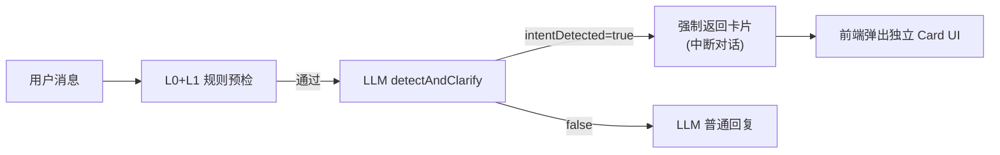
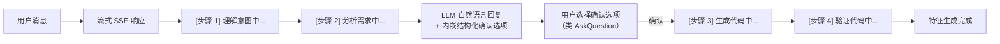

# Agent 对话体验重构

## 执行质量强制规则

**总预计时间：≥ 6 小时**，各 todo 预算之和为 360 分钟。

### 时间预算规则（每个 todo 强制执行）

每个 todo 的预算时间是**最低门槛，不是上限**。完成基本功能后如果时间还有剩余，必须继续做以下事情，直到预算用完或达到最高质量标准：

1. 补充更多边界 case 测试（错误路径、空值、并发）
2. 审查代码是否有硬编码字符串 / 魔法数字，有则重构为常量
3. 审查所有异步函数是否有完整的 try/catch + fallback
4. 检查函数长度，超过 40 行的考虑拆分
5. 补充 JSDoc 注释（参数类型、返回值、异常场景）
6. 对照 ADR 不变式逐条验证本 todo 的实现是否符合约束

### 最高质量标准（提前标 completed 的唯一出口）

满足以下**全部**条件才允许提前标 `completed`：

- 完成检查清单 3 条全部通过且能逐条举证
- 无任何 `TODO` / `FIXME` / `HACK` 注释残留
- 无硬编码字符串（全部引用常量或 schema）
- 所有异步路径均有 fallback
- 新增代码行数的 30% 以上是测试代码

---

## 核心问题




两个核心问题：

- **触发太死板**：意图检测是「开关」而非「渐进」，误触发时直接中断对话，没有中间状态
- **无 Agent 感**：所有中间步骤（意图检测 → 代码生成 → 验证）对用户完全不可见

## 目标架构




## 改动一：意图触发改为对话内嵌选项

**核心思路**：不再单独返回 `clarification` 卡片，而是让 LLM 回复正常对话，同时在回复末尾附带一个 `inlineOptions` 结构（类似 AskQuestion 工具）。

### `[scripts/server/handlers/chat.js](scripts/server/handlers/chat.js)`

当前逻辑（问题所在）：

```javascript
// 只要 intentDetected=true 就直接 return，不走普通对话
if (gating.shouldTriggerClarification) {
  return { clarification: card };  // 中断对话
}
```

改为：

- 去掉 clarification fast path 的独立分支
- 将意图信息传给 `generateChatReply`，让 LLM 同时生成「回复文本」+「inlineOptions 数组」
- 返回结构变为 `{ reply: "...", inlineOptions: [{id, label, value}] }`
- 前端根据 `inlineOptions` 在消息底部渲染选项（而不是单独弹卡片）

### `[scripts/server/core/pipeline/prompts/intent-clarification.js](scripts/server/core/pipeline/prompts/intent-clarification.js)`

修改 System Prompt，要求 LLM 在检测到创建意图时，回复中返回 JSON 尾部的 `__OPTIONS__` 标记：

```
如果检测到用户想创建特征，在回复末尾追加：
__OPTIONS__:[{"id":"confirm","label":"是的，帮我生成","value":"confirm"},{"id":"custom","label":"我再说清楚一些","value":"custom"},{"id":"skip","label":"先不用"}]
```

---

## 改动二：流式 Agent 步骤进度

### 新增 `/api/ai/chat/stream` (SSE endpoint)

在 `[scripts/server/http/route-table.js](scripts/server/http/route-table.js)` 注册新路由，返回 SSE 流，逐步 emit 步骤事件：

```javascript
// SSE 事件类型设计
{ type: "step", step: 1, label: "正在理解你的意图..." }
{ type: "step", step: 2, label: "正在分析特征需求..." }
{ type: "delta", content: "好的，我来帮你..." }  // LLM token streaming
{ type: "options", data: [{id, label, value}] }   // 内嵌选项
{ type: "step", step: 3, label: "正在生成 Python 代码..." }  // 用户确认后
{ type: "step", step: 4, label: "正在验证代码..." }
{ type: "done", featureName: "ema_crossover" }
```

### `[scripts/server/handlers/chat.js](scripts/server/handlers/chat.js)` 新增 `handleAiChatStream`

将当前 `handleAiChat` 的顺序调用改为 SSE emit 版本：

```
emit step1 → 运行 L0+L1 → 
emit step2 → 调用 LLM (流式) → 
解析 inlineOptions → emit options →
等待用户确认 (新 confirm endpoint) →
emit step3 → 代码生成 →
emit step4 → 代码验证 →
emit done
```

### 用户确认交互

新增 `POST /api/ai/chat/confirm` endpoint：

- 接收 `{ sessionId, optionId, optionValue, featureConcept }` 
- 根据选择决定是否触发 `generateFromClarification`
- 同样以 SSE 流形式返回后续步骤进度

---

## 改动三：前端 (memory/report/)

- 新增 `InlineOptions` 组件：在消息气泡底部渲染选项按钮（不是独立卡片）
- 新增 `AgentSteps` 组件：步骤进度**折叠展示**，类似 Claude extended thinking：
  - 任务执行中：展开显示当前步骤（`▶ 正在生成代码...`）
  - 任务完成后：折叠成一行（`▶ 查看思考过程`），点击可展开回溯
  - 折叠行内容永久保留在对话气泡中，不消失
- 将 `/api/ai/chat` 切换到 `/api/ai/chat/stream` (EventSource)
- 保留旧 Card UI 作为兼容（注册成功后的特征展示卡不变）

---

## 改动五：代码质量保障体系

### A. 架构层 — 统一 Schema 定义

新增 `scripts/server/core/sse-schema.js`，集中定义所有 SSE 事件类型和 inlineOptions 结构，所有地方只能引用这个文件，不得散落硬编码：

```javascript
// SSE 事件类型枚举（不得随意新增，改动需同步更新此文件）
export const SSE_EVENT_TYPES = Object.freeze({
  STEP: "step",       // 步骤进度
  DELTA: "delta",     // LLM token 流
  OPTIONS: "options", // 内嵌确认选项
  DONE: "done",       // 任务完成
  ERROR: "error",     // 错误（必须 emit，不得让前端挂起）
});
// inlineOptions 每个选项的结构约束
export function assertOption(opt) { ... }
```

### B. Prompt 层 — 反模式禁止清单

在 `FEATURE_FROM_CLARIFICATION_SYSTEM_PROMPT` 中加入禁止清单：

- 禁止硬编码特定的 API URL（必须用 `os.environ.get`）
- 禁止无 `try/except` 的网络调用
- 禁止生成无意义的 `time.sleep()` 或轮询逻辑
- 禁止生成超过 80 行的单函数
- 输出列必须以 `tc_feat_` 开头（已有，需强化）

### C. Review 层 — Todo 完成门禁

每个 todo 完成后，执行顺序：

1. `npm run lint`（或 `node --check`）— 零 error 才能继续
2. 跑现有 e2e（至少 `e2e-clarification-flow-test.js`）— 不得新增失败
3. 人工 review 新增代码中是否有硬编码字符串、无 fallback 的异步调用

### D. 文档层 — ADR（架构决策记录）

新增 `docs/adr-001-sse-agent-flow.md`，记录：

- 为什么用 SSE 而不是 WebSocket
- 为什么用 `__OPTIONS__` 标记而不是 function calling
- inlineOptions 和旧 Card 的边界：何时用哪个
- 关键不变式：SSE 流任何错误都必须 emit `error` 事件后关闭，不得静默失败

---

## 改动四：测试保障

### 现有测试的冲突点

现有 `e2e-clarification-flow-test.js` 的 Step 5 显式断言旧流程：

```javascript
isFastPath: chatResult?.source === "clarification_fast_path",  // 新流程会变
emptyReply: !String(chatResult?.reply || "").trim(),           // 新流程有 reply
hasClarification: Boolean(chatResult?.clarification?.intentDetected),  // 结构变了
```

改动后这些断言全部失效，必须同步更新。

### 单元测试（`trading-intent-skill.test.js` + intent-gating）

补充以下边界用例：

- L0+L1 应拦截但当前会误触发的 case（如"帮我优化一下这个指标"）
- L0+L1 应放行但当前会漏掉的 case（如"我想搞个量化信号看看"）
- `__OPTIONS__` 解析逻辑的正确性（有/无/格式错误）

### E2E 测试（新增 `e2e-stream-flow-test.js`）

覆盖完整新链路：

```
POST /api/ai/chat/stream → SSE 收到 step1/step2/delta/options →
POST /api/ai/chat/confirm (optionId="confirm") → SSE 收到 step3/step4/done →
GET /api/strategy/features → 验证特征已自动加入特征库
```

同时覆盖 edge case：

- 用户点「先不用」→ 特征不加入，对话继续
- 用户点「再说清楚些」→ AI 追问，不触发代码生成
- pipeline 代码生成失败 → SSE 推送错误状态，对话不中断

---

## 文件变更清单

- `scripts/server/handlers/chat.js` — 核心改造：拆分为普通/流式，集成 inlineOptions 解析
- `scripts/server/http/route-table.js` — 注册新路由
- `scripts/server/core/pipeline/prompts/intent-clarification.js` — 修改 Prompt 以输出 inlineOptions
- `scripts/server/core/pipeline/index.js` — 支持 progress callback（emit 步骤事件）
- `memory/report/` — 前端：InlineOptions + AgentSteps 组件，切换到 SSE

## 交付

所有 todo 完成、e2e 全部 PASS 后，将改动推送到远程分支：

```bash
git checkout -b feat/freqtrade-e2e-delivery
git add .
git commit -m "feat: SSE agent flow with inline options and step progress"
git push -u origin feat/freqtrade-e2e-delivery
```

推送前必须确认：

- 所有 e2e 测试 PASS（包括新增的 e2e-stream-flow-test.js）
- `git status` 无意外文件（不提交 `.env`、`memory/` 运行时数据、`node_modules/`）
- commit message 符合现有仓库风格

