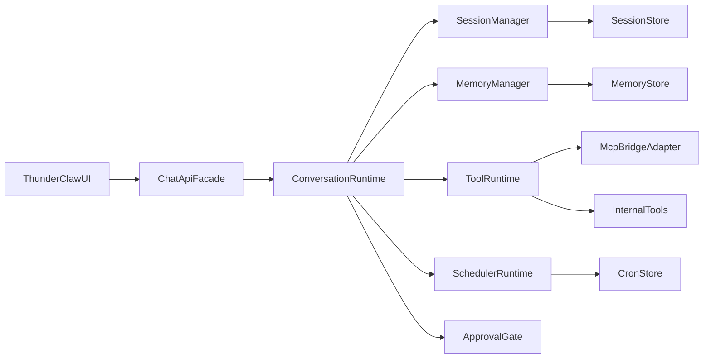

# ThunderClaw 对话子系统全量重建计划（对齐 OpenClaw）

## 目标与边界

- 路线：按你选择的 **full_rebuild**，不再在 `[/Users/aragorn/Desktop/claw-system/scripts/serve-report.js](/Users/aragorn/Desktop/claw-system/scripts/serve-report.js)` 里继续堆“写死分支”。
- 首波能力一次覆盖：记忆、任务、调度、工具调用、会话、安全审批。
- 交付标准：ThunderClaw 前端继续可用，但对话执行内核切换为“OpenClaw 风格网关 + 运行时”。

## 现状基线（用于迁移）

- 当前聊天入口已模块化到路由层：`[/Users/aragorn/Desktop/claw-system/backend/src/routes/chat.js](/Users/aragorn/Desktop/claw-system/backend/src/routes/chat.js)`、`[/Users/aragorn/Desktop/claw-system/backend/src/routes/index.js](/Users/aragorn/Desktop/claw-system/backend/src/routes/index.js)`。
- 核心能力仍集中在超大文件 `[/Users/aragorn/Desktop/claw-system/scripts/serve-report.js](/Users/aragorn/Desktop/claw-system/scripts/serve-report.js)`（tool router、memory、chat API）。
- 前端对话强耦合+硬编码在 `[/Users/aragorn/Desktop/claw-system/scripts/perp-report-viewer.js](/Users/aragorn/Desktop/claw-system/scripts/perp-report-viewer.js)`。
- 你仓库里已有 OpenClaw 参考实现可直接借鉴：
  - 调度：`[/Users/aragorn/Desktop/claw-system/tmp-openclaw/src/gateway/server-cron.ts](/Users/aragorn/Desktop/claw-system/tmp-openclaw/src/gateway/server-cron.ts)`
  - 审批：`[/Users/aragorn/Desktop/claw-system/tmp-openclaw/src/infra/exec-approvals.ts](/Users/aragorn/Desktop/claw-system/tmp-openclaw/src/infra/exec-approvals.ts)`
  - 会话：`[/Users/aragorn/Desktop/claw-system/tmp-openclaw/src/gateway/server-methods/sessions.ts](/Users/aragorn/Desktop/claw-system/tmp-openclaw/src/gateway/server-methods/sessions.ts)`
  - 记忆检索：`[/Users/aragorn/Desktop/claw-system/tmp-openclaw/src/agents/tools/memory-tool.ts](/Users/aragorn/Desktop/claw-system/tmp-openclaw/src/agents/tools/memory-tool.ts)`

## 目标架构（重建后）

## 分阶段实施

### 阶段1：内核拆分与可切换网关

- 新建 `backend/src/runtime/` 子系统（conversation/session/memory/tool/scheduler/safety 模块）。
- 将 `serve-report.js` 中以下能力抽离为独立服务并保留兼容 facade：
  - `handleNaturalLanguageToolOrchestration`
  - `resolveCapabilityAdapter`
  - `buildLayeredMemoryBundle`
  - `handleChatApi`
- 路由层改为双栈：`legacy` 与 `openclaw-native` 可通过 env 开关灰度切换。

### 阶段2：会话与记忆升级（先稳住“有脑子”）

- 引入会话 store（按 sessionKey 隔离，支持 reset/compact/resume）。
- 记忆改为“检索优先”，支持 `memory_search` / `memory_get` 风格工具调用。
- 对话请求必须先做记忆检索门控，再决定是否走工具链。

### 阶段3：任务系统与调度系统（先能做事）

- 引入 TaskRegistry + TaskExecutor + TaskStateStore（可观察状态：queued/running/success/failed）。
- 引入 SchedulerRuntime（cron 表达式、自然语言时间解析、job 归属 session）。
- 保证调度不是写死业务：调度只负责触发“任务”，任务由工具链执行。

### 阶段4：工具运行时统一（function calling / MCP）

- 统一 ToolManifest（schema、权限级别、可见范围、幂等标识）。
- 将当前 bridge 逻辑从 `[/Users/aragorn/Desktop/claw-system/scripts/mcp-bridge-local.js](/Users/aragorn/Desktop/claw-system/scripts/mcp-bridge-local.js)` 对齐为标准工具执行协议（traceId、timeout、retry、fallback）。
- 前端不再感知“哪种工具模式”，只消费统一事件流。

### 阶段5：安全审批与审计（能做事但不乱做）

- 引入 ApprovalGate：`deny/allowlist/full` + `ask: off/on-miss/always`。
- 高风险命令（shell/写文件/外联）必须可配置审批。
- 加审计日志（谁触发、工具参数摘要、审批决策、结果）。

### 阶段6：前端对话体验重构（从“脚本感”到“Agent感”）

- `perp-report-viewer.js` 拆分到 `frontend/src/modules/chat/`（渲染、状态、事件流、输入控制）。
- 去除硬编码策略/周期/行为分支，改为后端能力驱动。
- 增加“执行轨迹 UI”：思考→工具调用→审批→执行→结果，支持逐步回放。

## 验收标准（必须全过）

- 记忆：跨轮次、跨天能正确引用历史决策与偏好。
- 任务：可从自然语言生成并执行任务，失败可重试。
- 调度：可通过对话创建/修改/暂停任务，并按时触发。
- 工具：MCP 与内置工具可混用，错误可回退。
- 会话：多会话隔离，不串上下文，支持恢复。
- 安全：敏感操作审批与审计可查，默认最小权限。
- 稳定性：页面打开无报错；核心流程端到端回归通过。

## 首批落地文件范围（重点）

- 现有重构入口：`[/Users/aragorn/Desktop/claw-system/backend/src/routes/chat.js](/Users/aragorn/Desktop/claw-system/backend/src/routes/chat.js)`
- 新增运行时目录：`/Users/aragorn/Desktop/claw-system/backend/src/runtime/*`
- 过渡层保留：`[/Users/aragorn/Desktop/claw-system/scripts/serve-report.js](/Users/aragorn/Desktop/claw-system/scripts/serve-report.js)`
- 前端聊天重构入口：`[/Users/aragorn/Desktop/claw-system/scripts/perp-report-viewer.js](/Users/aragorn/Desktop/claw-system/scripts/perp-report-viewer.js)`
- MCP 适配增强：`[/Users/aragorn/Desktop/claw-system/scripts/mcp-bridge-local.js](/Users/aragorn/Desktop/claw-system/scripts/mcp-bridge-local.js)`

